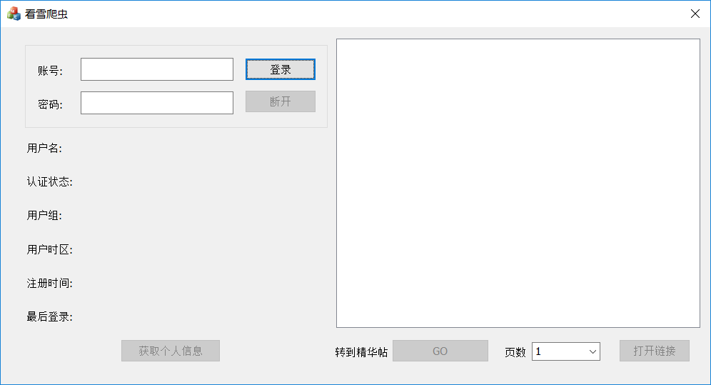

# 看雪爬虫
___
用到的库:
* libcurl
* htmlcxx

注意: 改工程只能在vs2013中编译并运行, 如需其他版本, 请重新编译各种库

-----
程序界面:

使用步骤:
1. 登陆自己的看雪账号
2. 点击 '获取个人信息' 可以加载个人信息
3. 点击 'GO' 并选择页数, 可以获取对应精华帖的全部链接
4. 选中某个精华帖链接, 点击 '打开链接' 可以访问该帖

---

 各类库的用法:

htmlcxx:
 > https://blog.csdn.net/li_jian_xing/article/details/44352805

libcurl:
 > https://blog.csdn.net/imred/article/details/53115885

 
